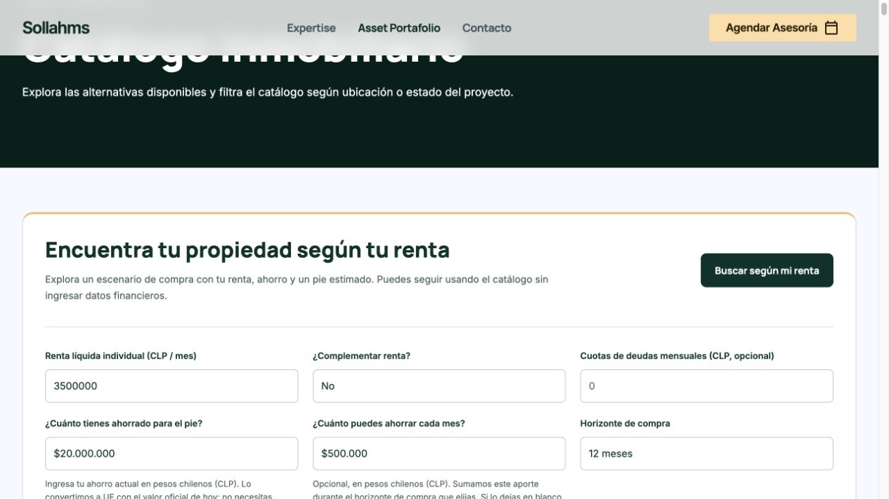
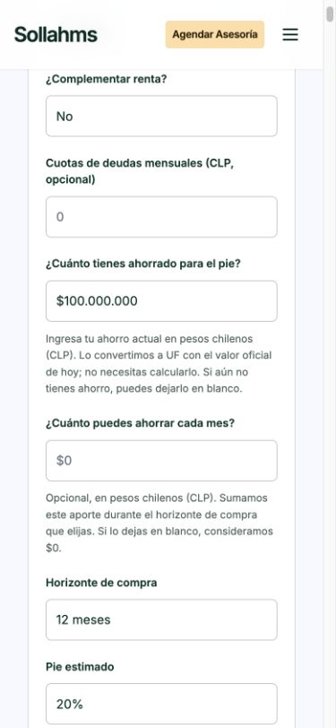

# Ahorro del buscador financiero exclusivamente en CLP

Fecha de verificación: 10 de octubre de 2026. Rama: `codex/integracion-financiera-sollahms`.

## Cambio

- Se eliminó el selector «Moneda del ahorro» del catálogo.
- Ahorro actual: «¿Cuánto tienes ahorrado para el pie?», en CLP, con explicación asociada mediante `aria-describedby`.
- Ahorro mensual: «¿Cuánto puedes ahorrar cada mes?», opcional, también en CLP. Ambos campos vacíos equivalen a $0.
- Se aceptan pesos enteros sin separadores, con puntos de miles o con `$`: `5000000`, `5.000.000`, `$5.000.000`. Al salir del campo o evaluar se muestra `$5.000.000`; al enfocar se muestran dígitos para facilitar la edición. No se reasigna el texto si ya es igual, para conservar la selección.
- Validación sin coerción ni truncamiento: rechaza negativos, decimales, exponentes, letras, agrupación incorrecta y exceso de rango. Límites CLP del motor existente: ahorro actual $1.000.000.000.000; ahorro mensual $10.000.000.000. Se eliminó el límite visible incorrecto de 1.000.000.
- La interfaz entrega CLP al motor y muestra ahorro, ahorro al horizonte y brecha en CLP, acompañados por su equivalencia UF. Se conserva el motor de capacidad, sus horizontes, pie y clasificación A–E.

## UF y alcance

Se volvió a contrastar la UF del 10-10-2026: $41.136,24, con [la tabla oficial SII](https://www.sii.cl/valores_y_fechas/uf/uf2026.htm). No se modificó el conjunto de datos financieros. La referencia sólo permite conversiones cuando está vigente para el día en Chile. Una UF vencida, futura, ausente o inválida impide convertir ahorro CLP y clasificar compatibilidad; se explica la situación y se mantiene el catálogo navegable. No se extrapola una cotización futura.

Sin diferencias respecto a `ad377cf4e56ad3f3110c4579647d69763983dc10` en comparador, motor hipotecario, motor de capacidad, API, bibliotecas, datos comerciales o fuentes financieras. No se modificaron otras ramas ni Production.

## Pruebas

- **154 pruebas automatizadas aprobadas, cero fallas**, ejecutadas nuevamente después de la última mejora de edición. Incluyen 11 nuevas pruebas de parseo, formato, límites y equivalencia financiera, y 20 pruebas de la interfaz (13 anteriores y 7 nuevas). Las regresiones existentes cubren comparador, contacto, contexto de los 148 proyectos, agenda y protección de Preview con proveedores simulados.
- Navegador real: $5.000.000, $20.000.000 y $100.000.000 aceptados y formateados; mensual vacío aceptado como cero. Distrito Centro, renta de prueba $3.500.000, pie 20%, 20 años, tasa efectiva 4,5%: los dos primeros ahorros dan B y $100.000.000 da A. No es una oferta ni aprobación bancaria.
- Horizonte real: $20.000.000 + $500.000 × 12 = $26.000.000; Distrito Centro pasa a A y conserva el tiempo de ahorro de 5 meses para cubrir el pie bajo ese escenario.
- Navegador: negativos, `5,5`, `5.5` y $1.000.000.000.001 bloqueados con mensaje; no quedan resultados anteriores. Reiniciar limpia valores, errores y resultados sin alterar filtros.
- Responsive: 1280 px, 768 px, 390 px y 320 px; sin desbordamiento horizontal, campos de 48 px de alto, ayudas legibles y `inputmode="numeric"`.
- Integridad: 148 fichas y sus enlaces, 496 fotografías oficiales, 509 archivos originales, 137 mapas y 98 instancias de recorridos conservados. Se comprobaron 3.137 enlaces internos. Datos pendientes de verificación sin cambios.
- Build de Preview aprobado: 155 páginas, dos JSON públicos autorizados, `noindex`; documentos, pruebas y registros no se publican.
- Servidor local aislado: 0 contactos, 0 reservas, 0 invocaciones de proveedor y 0 solicitudes externas del servidor durante esta revisión de ahorro.

Comando de suite: `node --test tests/*.test.mjs tests/booking-project-context.mjs tests/form-regression.mjs tests/rut*.mjs tests/integration-*.mjs`. Validaciones adicionales: `validate-project-details.py`, `validate-final-adjustments.py`, `validate-financial-integration.py` y `scripts/package-vercel.mjs` con entorno Preview y la rama indicada.

## Evidencia y revisión

Destino de revisión: [Preview protegida de la rama](https://project-wrapp-git-codex-integr-460693-lsandoval2-8260s-projects.vercel.app/proyectos.html). La integración Git de Vercel actualiza únicamente esta Preview; debe verificarse el estado READY y el SHA del commit antes de entregar. Production conserva `dpl_B2yGdPCsFsg9fdHdVUBYF9j6qwsF`, vinculado a `main` `69eb89524d38071a5b5df6a032e105f0aa958d87`. No hacer merge ni promoción a Production.
