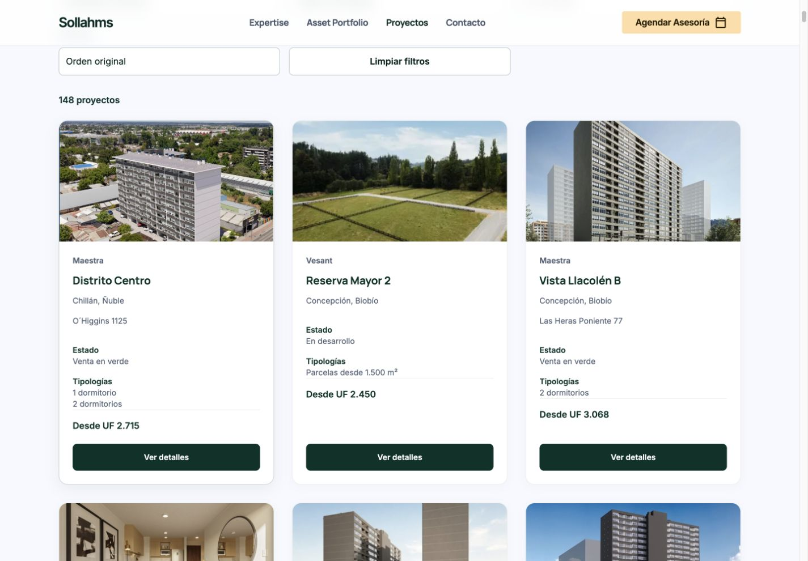

# Ajustes finales del catálogo y formulario de contacto

Fecha de cierre: 10 de octubre de 2026. Rama: `codex/fichas-proyectos-completas`.

Los cambios de aplicación están en `6f054130aaf1814df4b00a68f9fb0a07717f971f`. Se conservaron las 148 fichas y la investigación existente. Este informe documenta las pruebas de ese commit y reemplaza las descripciones históricas del campo visible «Asunto»; no cambia los resultados comerciales de la revisión anterior.

[Preview protegida de la rama](https://project-wrapp-git-codex-fichas-eb9b71-lsandoval2-8260s-projects.vercel.app/proyectos.html). El despliegue probado `dpl_4i3nucBZPkNyz2SoWHpmvBjKGRmQ` llegó a `READY`, corresponde al commit de aplicación indicado y tiene destino Preview. El commit de cierre incorpora únicamente este informe y evidencia privada del repositorio; Vercel actualiza el mismo alias de rama. La identidad del despliegue final se comprueba por separado al entregar para evitar una referencia circular al commit de este informe.

## Cambios implementados

- Las 148 tarjetas tienen portada 16:9: 140 fotografías oficiales existentes y ocho placeholders de marca. La fotografía y «Ver detalles» enlazan a la ficha correspondiente. Se conservaron las portadas principales de las cuatro destacadas; para las restantes se reutilizó la primera fotografía oficial usada en la ficha. No se descargaron ni generaron imágenes.
- El catálogo mantiene únicamente «Ver detalles». Los botones «Consultar proyecto» y «Agendar Asesoría» de las fichas se conservaron.
- Se retiraron 493 leyendas repetitivas visibles de las galerías. Las fotografías, sus enlaces, mapas, recorridos, datos comerciales y metadatos de investigación se conservaron. La comparación con el commit anterior verifica que las 148 fichas sólo cambian por la eliminación de esas leyendas.
- Contacto reemplaza el campo visible «Asunto» por «RUT», opcional, con validación de módulo 11 en navegador y servidor. Acepta puntos, formato sin puntos, guion, formato sin guion y `K`/`k`; normaliza como cuerpo y dígito verificador con guion y `K` mayúscula. El campo vacío sigue siendo válido.
- El servidor recibe el slug, valida su pertenencia al catálogo y obtiene el nombre del proyecto de su propio registro. Genera «Consulta sobre <nombre verificado>» y conserva nombre y slug en el correo. Rechaza asunto, nombre o campos arbitrarios enviados por el navegador.
- Se añadieron errores accesibles, recuperación del botón tras error y bloqueo de solicitudes simultáneas. El formulario usa POST incluso cuando no carga JavaScript, para evitar que el navegador convierta sus datos en parámetros de URL. El fallback sin JavaScript no constituye un flujo de envío exitoso: el endpoint requiere JSON y devuelve 415 para una codificación no admitida.
- El aviso de privacidad describe el tratamiento implementado. No se añadió RUT a agendamiento, URLs, analítica, registros, asuntos de correo ni respuestas públicas; no hay consultas de identidad externas.

## Resultados de pruebas

| Verificación | Resultado y alcance |
| --- | --- |
| Pruebas automatizadas de contacto, RUT y agendamiento | 39 aprobadas, 0 fallidas; proveedores simulados. |
| Integridad de fichas | 148 HTML disponibles, 3.285 enlaces internos válidos, 137 mapas y 153 URLs del sitemap. |
| Comparación con baseline `1465b49c6888f112f8b529922c23549bec34fcdd` | 148 fichas comparadas; 496 archivos originales de fotografías sin cambios, 137 mapas y 98 instancias de recorridos conservadas; investigación, datos comerciales y agendamiento sin cambios. |
| HTTP local | 656 GET aprobados: 148 fichas, 503 recursos referenciados y cinco rutas globales/de datos. HTTP 200, MIME y bytes comparados con los archivos de origen. |
| Responsive local de todas las fichas | 148 × 5 tamaños = 740 comprobaciones; sin desbordamiento ni imágenes cargadas rotas; botones de consulta/agendamiento conservados. |
| Catálogo local y Preview | Todas las 148 tarjetas en 320, 390, 768, 1.024 y 1.440 px. En Preview son 740 comprobaciones de tarjeta; 140 fotografías cargadas tras recorrer todo el catálogo y ocho placeholders; proporción 16:9, enlace correcto, CTA único y tamaño cómodo. |
| Filtros y ordenamiento local y Preview | Diez escenarios aprobados: búsqueda, categoría, región, comuna, estado, precio máximo, ascendente, descendente, vacío y restablecer. Los 33 precios pendientes quedan al final. |
| Fichas representativas en Preview | Ocho fichas × cinco tamaños = 40 comprobaciones. Incluyen las cuatro destacadas, Independencia 4745 (Matterport), Terratoltén 1 (ECASA), BOX Santiago y Lomas de Puyai 3 (pendiente). Sin desbordamientos, imágenes cargadas rotas ni leyendas repetitivas; CTAs y fuentes de mapas/recorridos conservadas. |
| Formulario en navegador local | RUT inválido bloquea el POST; puntos/sin puntos/sin guion/K/vacío aprobados con proveedor simulado; éxito limpia campos conservando proyecto, error 502 y Preview 503 conservan los datos y recuperan el botón. |
| Formulario directamente en Preview | Cinco tamaños aprobados; RUT opcional, sin Asunto visible, error de RUT inválido y normalización de K. Un envío ficticio fue bloqueado por el handler de Preview antes del proveedor, conservando campos y contexto. |
| Contexto y seguridad del backend | Pruebas de los 148 slugs/asuntos verificados, rechazo de claves arbitrarias, formatos de entrada y RUT inválido, prevención de duplicados en frontend, errores, honeypot y bloqueo de Preview antes de cualquier proveedor. |
| Paquete de Preview local | 154 páginas con noindex; 509 recursos públicos con conjunto y hashes idénticos al origen; módulo RUT servido como JavaScript; documentación, tests, investigación privada y código de handlers no publicados como archivos estáticos. |
| Consola de navegador en Preview | Sin errores ni advertencias observados durante la revisión final. |
| Acciones reales | Cero correos y cero reservas reales. El servidor de pruebas local registró siete contactos ficticios, seis invocaciones simuladas y cero solicitudes externas. |

Comandos principales:

```sh
node --test tests/booking-project-context.mjs tests/form-regression.mjs tests/rut-contact.mjs
python3 tests/validate-project-details.py
python3 tests/validate-final-adjustments.py
VERCEL_ENV=preview VERCEL_GIT_COMMIT_REF=codex/fichas-proyectos-completas node scripts/package-vercel.mjs
```

Se utilizó el Node incluido en el runtime de Codex, porque no está instalado en el PATH del sistema. Las pruebas de duplicación de solicitudes pendientes se ejecutaron en el harness automatizado del frontend, no mediante una carrera de clics manual en Vercel.

## Correcciones durante la revisión

Se corrigieron la ausencia de fotografías en catálogo, el CTA adicional de sus tarjetas, las leyendas repetitivas de galería y el campo Asunto editable. Se reforzaron la derivación de contexto en servidor, la validación compartida del RUT, los estados de envío y el método POST de respaldo. El servidor de QA se reinició para cargar la versión final del backend y el MIME JavaScript del nuevo módulo antes de la verificación definitiva.

## Pendientes y límites

La revisión automática de permisos rechazó incluir el RUT en el correo enviado a Resend por falta de autorización explícita para transmitir ese identificador al proveedor externo. Se completó la alternativa permitida: el endpoint propio valida y normaliza el RUT, pero lo excluye del payload, cuerpo y asunto enviados al proveedor. No se persiste ni se consulta externamente. Por tanto, el destinatario del correo no recibe el RUT. La inclusión futura en el correo requiere resolver esa autorización; no se declara implementada.

Los ocho proyectos sin fotografía oficial siguen con placeholder:

- Edificio Teatinos 750.
- Edificio Vista Amunátegui.
- Mapocho 3521 Edificio A.
- Froilán Roa 5731 Torre Norte.
- Froilán Roa 5731 Torre Sur.
- Edificio Verne.
- Irarrázaval 1970.
- Lomas de Puyai 3.

Los pendientes comerciales anteriores permanecen registrados, sin inferencias: cuatro identidades de etapa (Mapocho Edificio A, Froilán Roa Norte y Sur, Lomas de Puyai 3), 33 precios, 52 fechas/condiciones de entrega y nueve direcciones, además de superficies y otros campos que no publican sus fuentes. Hay 11 fichas sin mapa y dos visores con disponibilidad visual pendiente: Endémico (visor general) y Vista Bulnes (Sentiovr). El inventario conserva el detalle por ficha en [registro-fichas-proyectos.md](registro-fichas-proyectos.md), y la investigación anterior está en [revision-preview.md](revision-preview.md).

Se conservan 18 proyectos con Matterport, 137 con mapa y 62 con alguna experiencia oficial enlazada. Esta iteración comprueba la conservación de las fuentes e integraciones, pero no repite la navegación habitación por habitación de cada visor. La revisión directa de Vercel utiliza la sesión autorizada del navegador con la protección de acceso intacta. La auditoría exhaustiva HTTP/hashes y las 740 comprobaciones de fichas se realizaron localmente; las ocho fichas representativas se revisaron además en Vercel. No se declara una auditoría HTTP pública remota de todos los archivos.

No se encontraron campos explícitos de crédito/licencia obligatorios en los metadatos existentes. Sólo se eliminaron las leyendas repetitivas; las fuentes y otros textos permanecen. Esto no constituye una nueva determinación de las licencias externas de las imágenes.

No se hizo merge, modificación de main ni despliegue en Production. El checkout compartido de otro desarrollo no se alteró. La entrega se detiene para revisión de la Preview por el usuario.

## Evidencia

Los registros y capturas están en [qa/ajustes-finales/](qa/ajustes-finales/). Resumen: [summary.json](qa/ajustes-finales/summary.json); integridad: [structural.json](qa/ajustes-finales/structural.json); HTTP: [http.json](qa/ajustes-finales/http.json); tests: [unit-independent.txt](qa/ajustes-finales/unit-independent.txt); paquete: [package-summary.json](qa/ajustes-finales/package-summary.json).

Responsive completo local: [detail-responsive.json](qa/ajustes-finales/detail-responsive.json). Preview: [tarjetas](qa/ajustes-finales/remote-catalog-cards.json), [filtros](qa/ajustes-finales/remote-catalog-filters.json), [fichas representativas](qa/ajustes-finales/remote-detail-representative.json) y [formulario](qa/ajustes-finales/remote-contact-browser.json).


