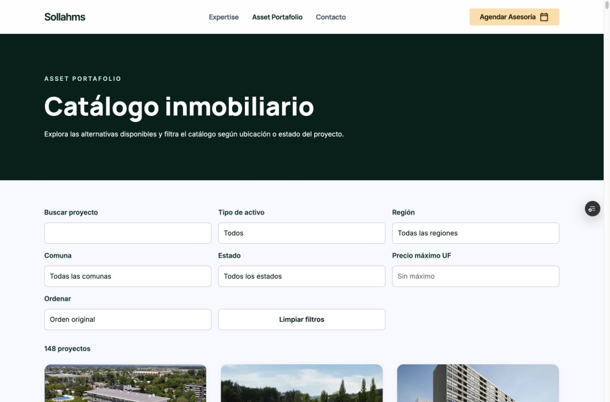
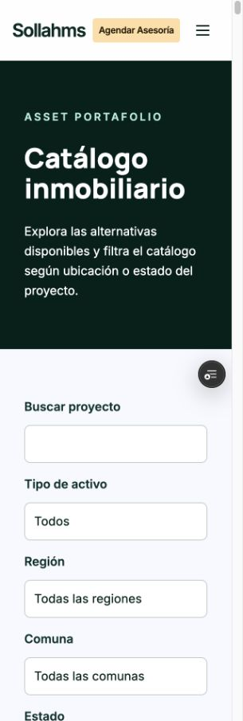

# Cabecera y navegación Asset Portafolio

Rama `codex/fichas-proyectos-completas`. Fecha: 10 de octubre de 2026.

En `proyectos.html`, el texto superior es «ASSET PORTAFOLIO» y el h1 es «Catálogo inmobiliario». Se conserva exactamente «Explora las alternativas disponibles y filtra el catálogo según ubicación o estado del proyecto.». Las clases, colores, tipografía, animaciones y espacios permanecen iguales; el título se adapta mediante los estilos responsive existentes.

Se actualizó la navegación compartida en 153 páginas públicas, incluidas las 148 fichas: «Expertise», «Asset Portafolio», «Contacto». Cada variante de escritorio y móvil tiene un único enlace «Asset Portafolio» a `/proyectos.html`. Se renombró el enlace anterior «Proyectos», conservando sus clases y `aria-current` en el catálogo; se retiró el antiguo enlace superior «Asset Portfolio» a la sección de inicio. El botón «Agendar Asesoría» mantiene su destino y contexto. El template de las fichas incorpora la misma navegación para no reintroducir la versión anterior al regenerar.

404 conserva su cabecera de marca, que no compartía el menú. Los enlaces del pie, breadcrumbs y datos estructurados permanecen fuera del alcance del ajuste del menú superior. No se modificaron tarjetas ni filtros.

## Verificación

| Comprobación | Resultado |
| --- | --- |
| Auditoría independiente de navegación | 153 cabeceras y 306 variantes de menú con etiquetas, orden y destino correctos; sin opción duplicada «Proyectos». |
| Comparación contra `95ae6bf48037c52b6fa7fb8b71add55686c7a044` | Las 148 fichas completas fuera de su header son idénticas; catálogo cambia únicamente en header y los dos rótulos. El template y los estilos de enlaces activos conservan el contrato. |
| Integridad de recursos y funciones | 521 archivos protegidos con hashes idénticos: 509 assets, cinco archivos de datos, tres APIs, dos módulos de servidor, sitemap y robots. Filtros, scripts y CSS inline del catálogo sin cambios. |
| Validación de todas las fichas | 148 páginas, 2.989 enlaces internos, 137 mapas y 153 URLs del sitemap: aprobada. La diferencia en cantidad de enlaces respecto al informe anterior corresponde a los dos enlaces superiores redundantes retirados por ficha. |
| Validación de fotografías y recorridos | 140 portadas oficiales, ocho placeholders, 496 archivos originales de fotos y 98 instancias de recorridos conservados; todas las fuentes y los datos comerciales sin cambios. |
| HTTP local | 656 GET aprobados: 148 fichas, 503 recursos referenciados y cinco rutas globales/de datos; HTTP 200, MIME correcto y bytes iguales al origen actual. |
| Formularios y contexto | 39 pruebas automatizadas aprobadas, cero fallidas, usando proveedores simulados. Incluyen los 148 contextos de consulta/agendamiento, RUT y bloqueo de envíos en Preview. |
| Responsive local y Vercel | Siete rutas en cinco anchos (320, 390, 768, 1.024 y 1.440 px): 35 comprobaciones locales y 35 directamente en Preview. Catálogo, inicio, Distrito Centro, Independencia 4745, contacto, agenda y privacidad; sin desbordamientos ni imágenes cargadas rotas observadas. |
| Interacciones de navegación | Expertise abre el ancla de inicio; Asset Portafolio abre catálogo; Contacto y Agendar Asesoría abren sus formularios. Tres menús móviles representativos abren, cierran con Escape y navegan al catálogo, conservando `aria-expanded`. Se comprobó localmente y en Vercel. |
| Filtros local y Vercel | Diez escenarios en cada entorno: búsqueda, categoría, región, comuna, estado, máximo UF, ascendente, descendente, resultado vacío y restablecer. Los 115 precios conocidos se ordenan correctamente y los 33 pendientes quedan al final. |
| Consola y acciones reales | Sin errores ni advertencias observados en la Preview final. Cero correos y reservas reales; el navegador local no hizo POST de contacto ni reservas. |

Comandos de regresión:

```sh
python3 tests/validate-project-details.py
python3 tests/validate-final-adjustments.py
node --test tests/booking-project-context.mjs tests/form-regression.mjs tests/rut-contact.mjs
```

Se ajustó el validador existente de integridad para permitir únicamente el cambio de navegación autorizado en sus baselines históricos; sigue exigiendo la igualdad del resto de cada ficha y de la lógica de agendamiento. No se añadieron tests que reproduzcan el cambio de textos.

## Preview y alcance

[Preview protegida](https://project-wrapp-git-codex-fichas-eb9b71-lsandoval2-8260s-projects.vercel.app/proyectos.html).

El commit de aplicación `474ff45d9dea1ab8359920c8153cd5a27a7b46bd` se probó directamente en el despliegue `dpl_J3goK6JdMJakosKMfGDFnZJxDNpC`, READY, Preview y con el alias de rama correcto. El commit de cierre incorpora solamente este informe y las evidencias; no cambia páginas públicas ni handlers. La identidad del último despliegue se verifica al entregar, evitando una referencia circular al SHA de este informe. La protección de acceso se mantuvo y se utilizó la sesión existente del navegador.

No se repitió un recorrido exhaustivo por todas las habitaciones de los visores externos: mapas y tours están byte a byte conservados y respaldados por sus fuentes. Los pendientes comerciales y los dos visores previamente pendientes permanecen como estaban. La auditoría HTTP de 656 recursos se realizó localmente; no se declara una auditoría HTTP pública de los archivos protegidos de Vercel.

El comparador existe exclusivamente en otra rama y no fue modificado ni integrado. El ajuste necesario de sus dos menús está documentado en [integracion-navegacion-comparador.md](integracion-navegacion-comparador.md). Su navegación queda pendiente de esa integración posterior.

No se hizo merge a main ni despliegue en Production. La revisión final conserva el desarrollo paralelo sin cambios y se detiene para revisión del usuario.

## Evidencia

[Resumen](qa/navegacion/summary.json), [auditoría independiente](qa/navegacion/navigation-independent.json), [HTTP local](qa/navegacion/http.json), [regresión](qa/navegacion/regression-independent.json), [responsive en Preview](qa/navegacion/preview-responsive.json), [interacciones en Preview](qa/navegacion/preview-menu-interactions.json), [filtros en Preview](qa/navegacion/preview-filters.json).




